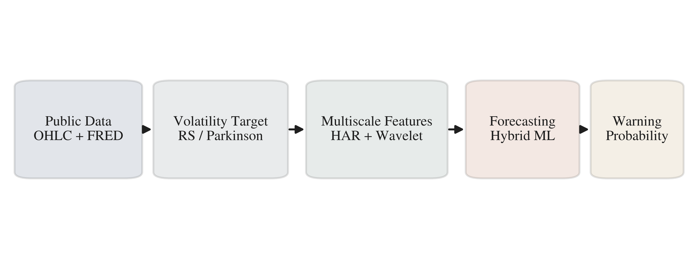
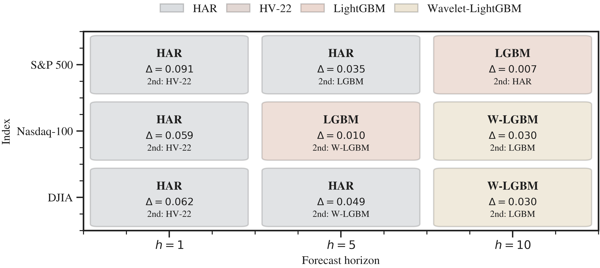

# Causal Multiscale Wavelet Spillover Learning for Stock Index Volatility Forecasting

<p align="center">
  <a href="https://www.mdpi.com/journal/risks">
    
  </a>
  
  
  
  
</p>

<p align="center">
  <b>Official implementation of:</b><br>
  <i>Public-Data Causal Multiscale Wavelet Spillover Learning for Stock Index Volatility Forecasting and Risk Early Warning</i><br>
  <b>Risks</b> (MDPI), 2026 — <i>Accepted</i>
</p>

---

## 👥 Authors

> *Author list to be updated upon official publication.*

| Name | Affiliation | Contact |
|------|-------------|---------|
| First Author | — | — |
| Second Author | — | — |
| Corresponding Author | — | — |

---

This repository provides a fully reproducible experiment pipeline for:

| | |
|---|---|
| 📈 | Stock index volatility forecasting (S&P 500, Nasdaq-100, DJIA) |
| 🚨 | Risk early warning system |
| 🌊 | Causal undecimated wavelet multiscale feature extraction |
| 🔗 | Cross-index spillover modelling |
| 📊 | Rolling / walk-forward evaluation with Diebold–Mariano & Clark–West tests |

## 🚀 Quick Start

**1. Install dependencies**

```bash
python -m venv .venv
. .venv/bin/activate
python -m pip install --upgrade pip
python -m pip install -r requirements.txt
```

**2. Download raw data** (Stooq OHLC + FRED macro series)

```bash
python -u scripts/run_pipeline.py --stage download
```

**3. Smoke test** — verify the pipeline end-to-end in minutes

```bash
python -u scripts/run_pipeline.py --smoke --stage all
```

**4. Full reproduction** — replicate all paper results

```bash
python -u scripts/run_formal_batches.py          # 3 indices × 3 horizons
python -u scripts/merge_batch_outputs.py         # merge + summary tables
python -u scripts/render_merged_plots.py         # figures
python -u scripts/generate_paper_assets.py       # paper-ready tables & figures
```

## 📁 Repository Structure

```
config/         experiment YAML configurations (main / plusdata / spillover)
data/           raw data downloaded by the pipeline (not tracked in git)
docs/           extended methodology notes and experiment synthesis
outputs/        experiment results, figures, tables (not tracked in git)
paper/          manuscript source (LaTeX), compiled PDF, and cover letter
plotting/       unified plot style loader
scripts/        pipeline entry-points and paper-asset generation scripts
src/            volatility_lab Python package (data, features, models, stats)
tests/          unit tests
```

## 📦 Main Outputs

| File | Description |
|------|-------------|
| `outputs/predictions/regression_predictions.csv` | All model roll-forward predictions |
| `outputs/predictions/classification_predictions.csv` | Risk warning predictions |
| `outputs/tables/regression_summary.csv` | QLIKE / RMSE / MAE / R² by model |
| `outputs/tables/diebold_mariano.csv` | DM test vs HAR benchmark |
| `outputs/tables/clark_west.csv` | Clark–West test for nested models |
| `outputs/figures/*.pdf` | Publication-ready figures |

## 🔬 Methods at a Glance

### Method Overview

<p align="center">
  
  <br>
  <em>Figure 1 — Overall pipeline: public data ingestion → causal wavelet multiscale decomposition → cross-index spillover features → hybrid stacking forecaster → risk early warning.</em>
</p>

### Main Results (QLIKE Heatmap)

<p align="center">
  
  <br>
  <em>Figure 3 — QLIKE loss heatmap across 18 models, 3 indices, and 3 forecast horizons. Lower is better. Wavelet-LightGBM and the stacking model consistently achieve the lowest QLIKE.</em>
</p>

<details>
<summary><b>18 Regression Models</b></summary>

| Category | Models |
|----------|--------|
| Linear baselines | Last-value, HV-5, HV-22, HAR, HAR-X |
| Volatility models | GARCH, EGARCH |
| ML baselines | SVR, Random Forest, LightGBM, XGBoost |
| **Main models** | **Wavelet-LightGBM, Stacking (HARX + Wavelet-LGB)** |
| Deep learning | MLP, LSTM, GRU, BiLSTM |

</details>

<details>
<summary><b>Wavelet Feature Engineering</b></summary>

- Causal undecimated DWT (Sym4 basis, 3 levels)
- Applied to: Rogers–Satchell variance, |returns|, VIX-like series
- Per-scale features: coefficients, rolling mean / std, energy
- Cross-index spillover features (d2/d3 inter-index transmission)

</details>

<details>
<summary><b>Risk Early Warning</b></summary>

- 6 classifiers: Logistic, Random Forest, LightGBM, main warning, naive/forecast threshold
- Rolling quantile labels for high-volatility events
- F-β = 2.0 threshold selection (recall-weighted)
- Evaluation: PR-AUC, Brier score, ROC-AUC

</details>

## 📊 Data Sources

| Source | Series | Description |
|--------|--------|-------------|
| [Stooq](https://stooq.com) | ^SPX, ^NDQ, ^DJI | Daily OHLC, 2005–2025 |
| [FRED](https://fred.stlouisfed.org) | DFF, DGS10, T10Y3M, NFCI, VIXCLS, … | Macro & volatility indicators |

> All data is **publicly available** and downloaded automatically by the pipeline.

## � Links

| Resource | URL |
|----------|-----|
| 📰 Journal — *Risks* (MDPI) | https://www.mdpi.com/journal/risks |
| 📊 FRED (macro data) | https://fred.stlouisfed.org |
| 📈 Stooq (market data) | https://stooq.com |
| 🐍 PyWavelets | https://pywavelets.readthedocs.io |
| 💡 LightGBM | https://lightgbm.readthedocs.io |
| 🤗 ARCH library | https://arch.readthedocs.io |

## 📄 Citation

> *Full citation to be added upon official publication.*

```bibtex
@article{risks2026wavelet,
  title   = {Public-Data Causal Multiscale Wavelet Spillover Learning for
             Stock Index Volatility Forecasting and Risk Early Warning},
  journal = {Risks},
  year    = {2026},
  note    = {Accepted}
}
```

## 🙏 Acknowledgements

We sincerely thank all collaborators and advisors who contributed to this work.

Special thanks to **[Haiyi Li (Gatsby0916)](https://github.com/Gatsby0916)** for his invaluable guidance, expert advice, and consistent support throughout the entire research and development process of this project.

We also gratefully acknowledge our supervisors and research partners for their insightful feedback, constructive discussions, and encouragement at every stage of this work.

## 📜 License

This project is licensed under the [MIT License](LICENSE).
